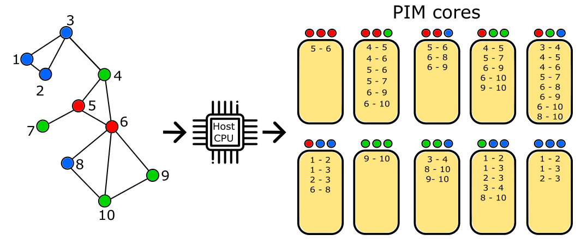

# Accelerating Triangle Counting with Real Processing-in-Memory Systems

This repository contains the source code for **PIM-TC**, an implementation of the Triangle Counting (TC) algorithm optimized for the UPMEM Processing-in-Memory (PIM) architecture.

## Overview

Triangle Counting (TC) is a fundamental graph analysis task used in various domains. However, TC is memory-bound and often struggles to scale on conventional CPU/GPU systems due to high memory bandwidth requirements and low data reuse. Processing-in-Memory (PIM) offers a promising solution by placing computation closer to memory.

This work presents the first TC algorithm designed for and evaluated on the real-world UPMEM PIM system. Our implementation addresses the specific limitations of this architecture:

1.  **Expensive Inter-Core Communication:** We employ a **vertex coloring** technique to partition the graph edges among the PIM cores such that triangles can be counted locally without the need for communication between PIM cores.
2.  **Limited DPU Memory:** We use **reservoir sampling** within each PIM core's local DRAM bank (MRAM) to handle graphs larger than the available memory, providing an approximate count with statistical adjustments.
3.  **Host-PIM Data Transfer Overhead:** **Uniform sampling** at the host level reduces the number of edges transferred to the PIM cores, speeding up data preparation and execution for approximate results.
4.  **High-Degree Nodes:** We optionally use the **Misra-Gries** summary algorithm during host processing to identify and re-label high-degree nodes, optimizing the edge-iterator approach on the PIM cores.

Our implementation accepts graphs in the standard Coordinate List (COO) format and demonstrates significant speedups compared to CPU-based methods for dynamic graph workloads where the COO format allows for efficient updates. Refer to the [Main Branch](https://github.com/CMU-SAFARI/PIM-TC/tree/main) for an implementation specifically designed to support static input graphs.


_Partitioning of the graph’s edges among the PIM cores through the host processor_

## Repository Structure

```
.
├── LICENSE             # Project license information
├── Makefile            # Build configuration for the project
├── README.md           # This file
├── common/             # Common headers used by host and DPU
│   └── common.h
├── dpu/                # Source code to be run on UPMEM DPUs
│   ├── dpu_util.c
│   ├── dpu_util.h
│   ├── locate_nodes.c
│   ├── locate_nodes.h
│   ├── quicksort.c
│   ├── quicksort.h
│   ├── task.c
│   ├── triangle_counter.c
│   └── triangle_counter.h
├── host/               # Source code running on the host CPU
│   ├── app.c
│   ├── handle_edges_parallel.c
│   ├── handle_edges_parallel.h
│   ├── host_util.c
│   ├── host_util.h
│   ├── mg_hashtable.c
│   └── mg_hashtable.h
└── img/                # Images used in README
    └── edges_partitioning.png
```

## Prerequisites

-   **UPMEM SDK:** The code was tested with `UPMEM SDK v2024.1.0`. Download from the [UPMEM website](https://sdk.upmem.com/). Ensure the SDK environment is activated (`source <sdk_path>/upmem_env.sh`).
-   **Build Tools:** A standard C compiler (like `gcc`) and `make`.

## Installation

Compile the host and DPU code using the provided Makefile:

```bash
make
```

This will create the executable `app` in the `bin/` directory.

## Usage

### Configuration

Before compiling, you can adjust the following parameters:

-   **`NR_TASKLETS`** (in [Makefile](Makefile)): Number of tasklets (software threads) per DPU. Must be a power of 2. The paper uses 16 for best performance.
-   **`NR_DPUS`** (in [Makefile](Makefile)): Number of DPUs to use. This is determined by the number of colors (`C`) chosen for vertex coloring via the `-c` flag (see below). The Makefile value should match the value derived from C using the formula: `NR_DPUS = Binomial(C + 2, 3)`. Ensure the target system has at least this many DPUs available.
-   **`NR_THREADS`** (in [Makefile](Makefile)): Number of CPU threads used by the host for parallel processing (e.g., reading the graph, preparing batches). Set to the number of available CPU cores/threads for best host performance (the paper uses **32**).
-   **`WRAM_BUFFER_SIZE`** (in [`dpu_util.h`](dpu/dpu_util.h)): Size of the buffer in the DPU's scratchpad memory (WRAM) for holding edges during processing. Must not exceed 2048 bytes.

### Running the Application

Navigate to the `bin` directory after compilation and execute the application:

```bash
./app -f <nr_updates> <path_to_graph_file_1> <path_to_graph_file_2> ... [OPTIONS]
```

**Required Arguments:**

-   `-c <nr_colors>`: **(Required)** Number of colors (`C`) to use for vertex coloring. This determines the number of DPUs allocated (`Binomial(C + 2, 3)`).

-   `f <nr_updates>`: **(Required)** Number of graph update files. This must be followed by `<nr_updates>` paths to the graph files.

-   `<path_to_graph_files>`: **(Required)** Paths to the files containing the edges of the updates to the graph in Coordinate List (COO) (Matrix Market) format. There should be `<nr_updates>` paths.

**Optional Arguments (for approximation and optimization):**

-   `-p <keep_percentage>`: Probability (0.0 to 1.0) of keeping an edge during **uniform sampling** at the host level. Default is `1.0` (no sampling). Values less than 1.0 enable approximation for faster processing.

-   `-M <sample_size>`: Maximum number of edges to store in each DPU's MRAM bank for **reservoir sampling**. If the number of edges assigned to a DPU exceeds this, sampling occurs. Defaults to the maximum possible based on available MRAM if not specified. Enables approximation if triggered.

-   `-k <Misra_Gries_dictionary_size>`: Size (`K`) of the dictionary used by the **Misra-Gries** algorithm on the host (per thread) to find frequent (high-degree) nodes. Enables the high-degree node optimization if set.

-   `-t <nr_most_frequent_nodes_sent>`: Number (`t`) of the most frequent nodes (identified by Misra-Gries) whose edges are remapped before sending to DPUs. Default is 5. Ignored if `-k` is not set.

-   `-s <seed>`: Seed for random number generation used in coloring and sampling. Uses a random seed if not specified.

**Example:**

```bash
# Run exact count using 12 colors (-> 364 DPUs) with Misra-Gries (K=1000, t=20) on 3 updates of graph.mtx
./app -c 12 -k 1000 -t 20 -f 3 ./graph_update_0.mtx ./graph_update_1.mtx ./graph_update_2.mtx
```

## Reproducibility

This section provides details on the datasets and procedures used in the experiments described in the accompanying paper to facilitate reproducibility.

### Dataset Preprocessing

The input graph data must be preprocessed, divided, and formatted before being used. This process involves:

1.  Reading the raw graph file (assuming COO format, e.g., space-separated node ID pairs per line).
2.  Removing self-loops (edges `(u, u)`).
3.  Removing duplicate edges (treating `(u, v)` and `(v, u)` as the same edge).
4.  Shuffling the resulting unique edges randomly.

The shuffled edges are divided into a predetermined number of sequential portions. For each portion `X` (indexed from 0 to `num_portions - 1`) the following files are generated:

-   `graph_append_X.txt` contains only the set of edges that belong to the current X-th portion. These represent the new edge additions to the graph at this specific update stage.
-   `graph_increasing_X.txt` contains a cumulative collection of edges, comprising all edges from the very first portion (portion 0) up to and including the current X-th portion. This file represents the state of the entire graph, with all accumulated edges, at update stage `X`.

Each of the `graph_append_X.txt` and `graph_increasing_X.txt` files are then converted to the Matrix Market (`.mtx`) format by prepending the header line `max_node_id max_node_id valid_edge_count` specific to each file.

### Datasets Used in Evaluation

**Full WikipediaEdit Graph:**

The characteristics of the complete `WikipediaEdit` graph after preprocessing are as follows:

| Graph Name    | Source                                           | Valid Edges | Unique Nodes | Max Node ID | Max Degree | Average Degree | Triangles   | Connected Triples  | Global Clustering Coefficient |
| :------------ | :----------------------------------------------- | :---------- | :----------- | :---------- | :--------- | :------------- | :---------- | :----------------- | :---------------------------- |
| WikipediaEdit | [Konect](http://konect.cc/networks/edit-enwiki/) | 255,688,945 | 42,541,517   | 42,640,546  | 3,026,864  | 12.0207        | 881,439,081 | 33,785,432,110,811 | 7.827e-5                      |

**WikipediaEdit Dynamic Updates:**

The preprocessed `WikipediaEdit` graph was divided into 10 sequential updates. The following table shows the cumulative number of edges and triangles at each update stage `X` (from 0 to 9).

| Update Index | Cumulative Edges | Cumulative Triangles |
| :----------: | :--------------- | :------------------- |
|      0       | 25,568,894       | 876,933              |
|      1       | 51,137,788       | 7,084,850            |
|      2       | 76,706,682       | 23,877,455           |
|      3       | 102,275,576      | 56,451,591           |
|      4       | 127,844,470      | 109,781,967          |
|      5       | 153,413,364      | 190,797,210          |
|      6       | 178,982,258      | 302,813,832          |
|      7       | 204,551,152      | 451,723,805          |
|      8       | 230,120,046      | 644,195,329          |
|      9       | 255,688,945      | 881,439,081          |

### Baseline Comparisons

To evaluate the performance of PIM-TC on dynamic graphs, we compare it against CPU and GPU implementations using the preprocessed `WikipediaEdit` dataset, divided as described above.

**General Methodology:**

The comparison involves iterating through the 10 update stages (X from 0 to 9) of the `WikipediaEdit` dataset. For each stage `X`:

-   The **PIM-TC** application processes the sequence of `_append_0.mtx` through `_append_X.mtx` files. It incrementally updates its triangle count. The algorithm uses the best performing parameters found in [the reproducibility section](https://github.com/CMU-SAFARI/PIM-TC/tree/main?tab=readme-ov-file#Reproducibility) of the README in the Main branch.
-   The **CPU and GPU baselines** process the single `_increasing_X.mtx` file. This file represents the entire graph up to and including update stage `X`. These baselines re-process the full graph state at each stage as they do not inherently support incremental appends in the way PIM-TC does for this evaluation.

For each test, **2 warmup runs** were performed, followed by **5 measurement runs**. The average time of the 5 measurement runs is reported in the paper.

**CPU Baseline (Bader-Research):**

The CPU baseline uses the [Bader-Research/triangle-counting](https://github.com/Bader-Research/triangle-counting) implementation. To adapt it for dynamic graph comparison:

-   Clone the repository: `git clone https://github.com/Bader-Research/triangle-counting.git`
-   Modify `src/main.c`: Comment out all `benchmarkTC_P` or `benchmarkTC` lines except the one for `tc_MapJIK_P`. Additionally, modify the `main()` function in `src/main.c` to enable measuring the graph loading time separately.
-   Compile the code according to the repository's instructions (e.g., using `make`). Let the compiled executable be `tc_cpu`.
-   Run the command for each graph update, measuring the end-to-end runtime, which includes both loading and counting time:
    ```bash
    ./tc_cpu -P -f ../data/wikipediaEdit_increasing_X.mtx -x -q
    ```

**GPU Baseline (cuGraph):**

-   Use the files containing the increasing updates to the graph (e.g., `_increasing_X.txt`) **without** the header.
-   Ensure `cugraph` and `cudf` are installed in your Python environment.
-   Use the following Python function for each graph update, measuring the end-to-end runtime, which includes both loading and counting time:

    ```python
    import cugraph
    import cudf
    import time

    def run_cugraph_for_stage(file_path_increasing_X):
        start_load = time.time()
        # Read graph from COO (space separated, no header)
        gdf = cudf.read_csv(filepath_or_buffer=file_path,
                            delimiter=' ',
                            dtype=['int32', 'int32'],
                            header=None,
                            names=['src', 'dst'])

        G = cugraph.Graph(directed=False)
        G.from_cudf_edgelist(gdf, source='src', destination='dst')

        load_graph_time = time.time() - start_load
        print(f"Graph Loading Time: {load_graph_time:.4f} s")

        start_count = time.time()

        count = cugraph.triangle_count(G)

        count_time = time.time() - start_count
        print(f"Triangle Count Time: {count_time:.4f} s")

        return count / 3
    ```

## Citation

Please use the following citations to cite this work, if you find this repository useful:

Lorenzo Asquini, Manos Frouzakis, Juan Gómez-Luna, Mohammad Sadrosadati, Onur Mutlu, Francesco Silvestri, "[Accelerating Triangle Counting with Real Processing-in-Memory Systems](https://arxiv.org/abs/2505.04269)", arXiv:2505.04269 [cs.AR], 2025.

Bibtex entry for citation:

```
@misc{asquini2025accelerating,
    title={Accelerating Triangle Counting with Real Processing-in-Memory Systems},
    author={Lorenzo Asquini and Manos Frouzakis and Juan Gómez-Luna and Mohammad Sadrosadati and Onur Mutlu and Francesco Silvestri},
    year={2025},
    eprint={2505.04269},
    archivePrefix={arXiv},
    primaryClass={cs.AR}
}
```

## License

This project is licensed under the MIT License - see the [LICENSE](LICENSE) file for details.

## Acknowledgements

This work was supported in part by the Big-Mobility project (Uni-Impresa call, University of Padova), MUR PRIN 20174LF3T8 AHEAD, MUR PNRR CN00000013 (HPC, Big Data, Quantum Computing), ETH Future Computing Laboratory (EFCL), Huawei ZRC Storage Team, Semiconductor Research Corporation, AI Chip Center for Emerging Smart Systems (ACCESS), InnoHK funding, Hong Kong SAR, and European Union's Horizon programme [101047160 - BioPIM]. We acknowledge generous gifts from Google, Huawei, Intel, and Microsoft.
